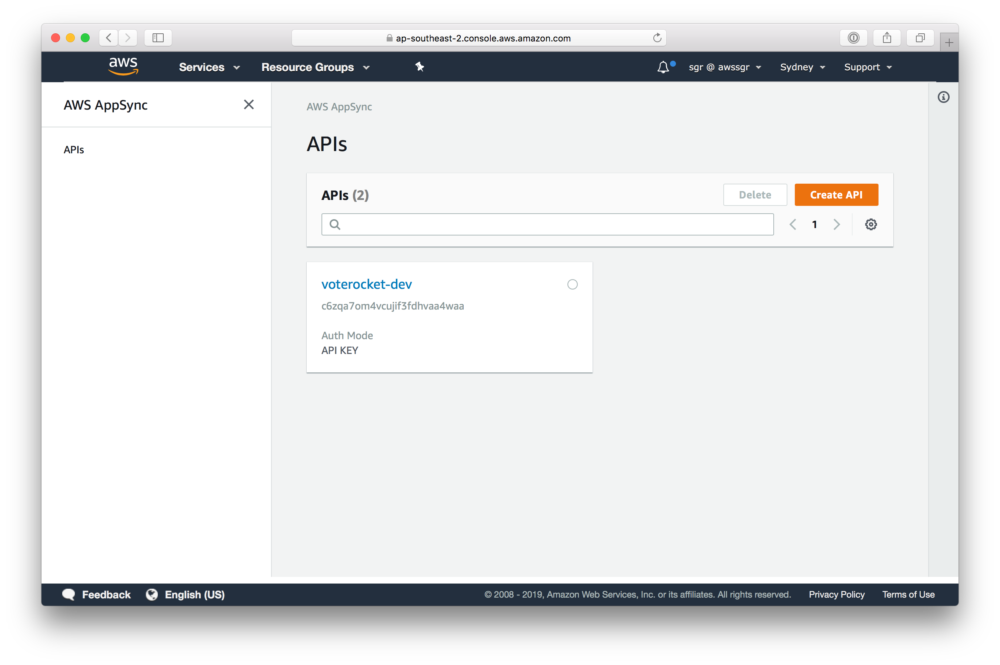
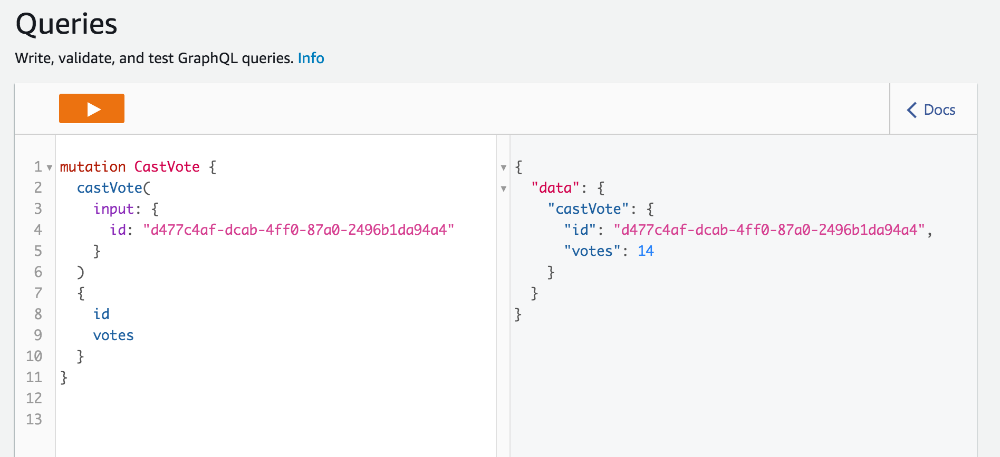
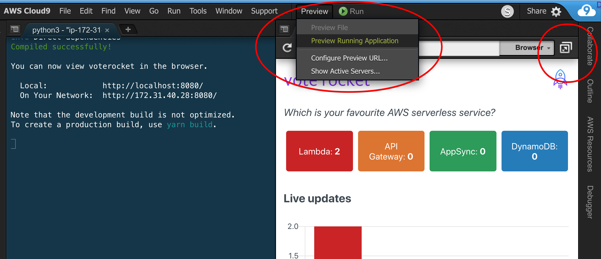
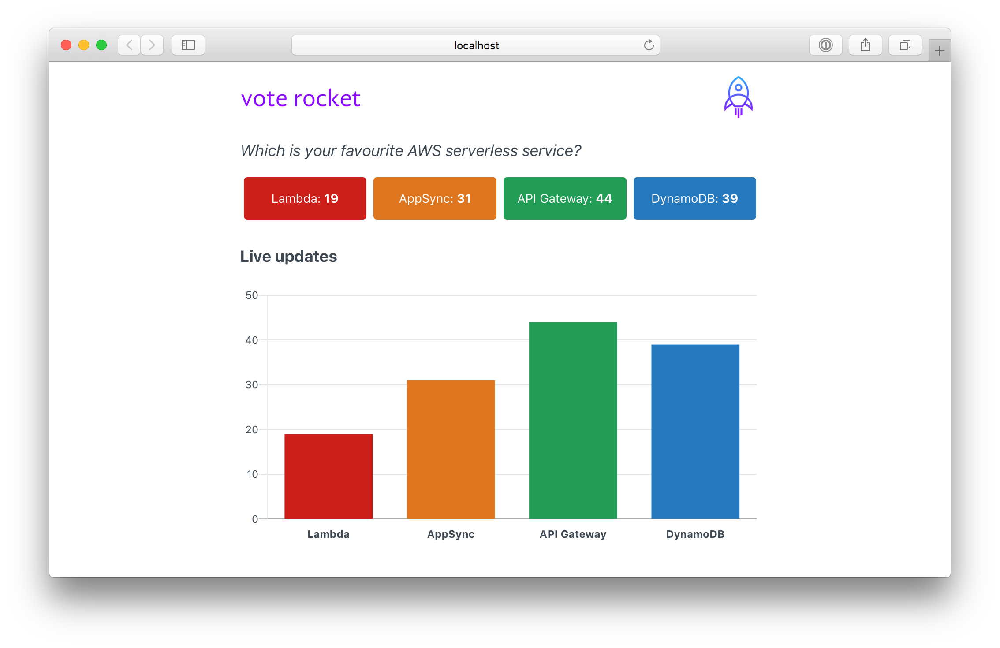

# Dev Labs: Build a modern serverless web application in minutes using the AWS Amplify Framework

<p align="center">
  
</p>

[AWS Amplify](https://aws.amazon.com/amplify/) makes it easy for you to create, configure, and implement scalable mobile and web apps powered by AWS. In this workshop we'll learn how to build the Vote Rocket voting web application with [React](https://reactjs.org/) and the [Amplify Framework](https://aws-amplify.github.io/)

## Topics we'll be covering:

- [Getting started - create the application](#getting-started---create-the-application)
- [Adding a GraphQL API](#adding-a-graphql-api)
- [Adding custom business logic to the GraphQL API](#adding-custom-business-logic-to-the-graphql-api)
- [Creating the React front-end application](#creating-the-react-front-end-application)
- [Lab complete! Where to from here?](#lab-complete-where-to-from-here)

## Prerequisites

This lab assumes the following:

- It's being executed in an [AWS Cloud9](https://aws.amazon.com/cloud9/) instance provided by the lab co-ordinator.
- This repository has been cloned into the default `~/environment` directory at `~/environment/voterocket-lab`
- The `~/environment/voterocket-lab/setup.sh` script has been executed to install and configure dependencies.

## If you get stuck or get an error

- In case you get stuck or need a reference to compare your implementation with, the full source is available at [https://github.com/awssgr/voterocket](https://github.com/awssgr/voterocket).
- Ask your lab co-ordinator for help.
- [Raise an issue](https://github.com/awssgr/voterocket-lab/issues/new) explaining the problem.

## Installing the CLI & initialising a new AWS Amplify project

### Installing the CLI

Install the AWS Amplify CLI:

```bash
npm install -g @aws-amplify/cli
```

## Getting started - create the application

**Note:** Be sure to start the lab in the default Cloud 9 directory:

```
cd ~/environment
```

Next, create a new React app using the [Create React App CLI](https://github.com/facebook/create-react-app). The `create-react-app` library will have been pre-installed by your lab co-ordinator.

```bash
create-react-app voterocket
```

Change into the `voterocket` directory & configure your project to work with the Amplify Framework:

```bash
cd voterocket
amplify init
```

You'll be prompted to answer some questions:

- Enter a name for the project `voterocket`
- Enter a name for the environment `dev`
- Choose your default editor: `None`
- Choose the type of app that you're building `javascript`

Please tell us about your project

- What javascript framework are you using `react`
- Source Directory Path:  `src`
- Distribution Directory Path: `build`
- Build Command:  `npm run-script build`
- Start Command: `npm run-script start`
- Do you want to use an AWS profile? `Yes`
- Please choose the profile you want to use: `> default`. 
  Choose `default` - (The `default` profile should have been configured by your lab co-ordinator)

The AWS Amplify CLI will initialise a new project inside your React project & you will see a new folder: `amplify`. The files in this folder hold your project configuration.

## Adding a GraphQL API

To add a GraphQL API (AppSync), we can use the following command:

```bash
amplify add api
```

You'll be prompted to answer some questions:

- Please select from one of the above mentioned services `GraphQL`
- Provide API name: `voterocket`
- Choose an authorization type for the API `API key`
- Do you have an annotated GraphQL schema? `N`
- Do you want a guided schema creation? `Y`
- What best describes your project: `Single object with fields (e.g. “Todo” with ID, name, description)`
- Do you want to edit the schema now? (Y/n) `Y`

Voterocket's schema requires we have a `Candidate` with an `id`, `name`, `description` and count of `votes` received.

When prompted (the file is at `amplify/backend/api/voterocket/schema.graphql`), replace the schema with the following:

```graphql
type Candidate @model {
  id: ID!
  name: String!
  description: String
  votes: Int!
}
```

Amplify CLI uses [GraphQL Transform](https://aws-amplify.github.io/docs/cli/graphql?sdk=js), which simplify the process of developing, deploying, and maintaining GraphQL APIs on AWS. Transforms are implemented using [directives](https://medium.com/open-graphql/graphql-directives-3dec6106c384)

This example uses the `@model` directive, which by default will [automatically configure these AWS resources](https://aws-amplify.github.io/docs/cli/graphql#generates).

Next, let's push the configuration to our account:

```bash
amplify push
```

- Do you want to generate code for your newly created GraphQL API `Y`
- Choose the code generation language target: `JavaScript`
- Enter the file name pattern of graphql queries, mutations and subscriptions: `(src/graphql/**/*.js)`
- Do you want to generate/update all possible GraphQL operations - queries, mutations and subscriptions? `Y`

The generated GraphQL (via the `@model` directive can be found in `amplify/backend/api/voterocket/build/schema.graphql`

The generated Javascript source can be found in `./src/graphql/` and provides pre-built queries, mutations and subscriptions that can be imported directly into your React application.

### Using the generated AppSync API.

The generated API can be found at [https://console.aws.amazon.com/appsync](https://console.aws.amazon.com/appsync). Ensure the region is set correctly :-)



In the AWS AppSync console, open your API & then click on **Queries**.

Paste the following into the console and run it.

```graphql
query AllCandidates {
  listCandidates {
    items {
      id
      name
      description
      votes
    }
  }
}
```

It should return an empty list. This is because there is no data in the underlying DynamoDB database.

### Adding a mutation from within the AWS AppSync Console

Add some `Candidate`s using a _mutation_ as below. This will add four entries and return a result:

```graphql
mutation createCandidates {
  candidate1: createCandidate(input: {name: "Lambda",      description: "Run code without thinking about servers",  votes: 0 }) {id, name, description, votes }
  candidate2: createCandidate(input: {name: "DynamoDB",    description: "Fast and flexible NoSQL database service", votes: 0 }) {id, name, description, votes }
  candidate3: createCandidate(input: {name: "API Gateway", description: "Managed RESTful APIs",                     votes: 0 }) {id, name, description, votes }
  candidate4: createCandidate(input: {name: "AppSync",     description: "Managed GraphQL APIs",                     votes: 0 }) {id, name, description, votes }
}
```

Executing the `AllCandidates` query above will now return the candidates created in the mutation.

We can also filter when querying. This is available because the Amplify CLI generated the transforms as described earlier.

```graphql
query NameContainsLambda {
  listCandidates(filter: {name: {contains: "Lambda"} }) {
    items {
      id
      name
      description
      votes
    }
  }
}
```

Will return only the `Candidate` whose name contains **Lambda**

## Adding custom business logic to the GraphQL API

Because this is a voting application we need to find a way to record a vote for a candidate. While we could use the `updateCandidate` mutation and resolver that was generated for us, this relies on having to increment the value on the client. It can't be guaranteed that all clients will have the same value for the vote count—it's much more robust to do this server-side<sup><a name="fnote_ref_1">[1.](#fnote1)</a></sup>.

This is how we would it if this were the AWS CLI:

```bash
aws dynamodb update-item \
    --table-name Candidate \
    --key '{ "id": {"S": "552e120b-3192-4cac-bb13-c8821472e6d6"} }' \
    --update-expression 'set #votesField = #votesField + :i' \
    --expression-attribute-values '{ ":i": { "N": "10"} }' \
    --expression-attribute-names '{ "#votesField": "votes" }'
```

For our GraphQL API to execute a similar `update-item` we need to create a custom resolver<sup><a name="fnote_ref_2">[2.](#fnote2)</a></sup>.

### Add `castVote` to your GraphQL schema

Add the following to your `schema.graphql`:

```graphql
input CastVoteInput {
  id: ID!
}

type Mutation {
  castVote(input: CastVoteInput!): Candidate
}

type Subscription {
  onCastVote: Candidate
    @aws_subscribe(mutations: ["castVote"])
}
```

This will allow us to call a `castVote` mutation that will increment the vote counter by 1, and enforce an input that has only the ID of the candidate. There is also a subscription type that will "push" real-time updates to a connected client when the mutation is called.

### Add the `castVote` resolver templates:

Copy the two `.vtl` files in this lab's `samples` folder into your project's `./amplify/backend/api/voterocket/resolvers` directory:

```bash
cp ~/environment/voterocket-lab/samples/Mutation.castVote.*.vtl ./amplify/backend/api/voterocket/resolvers/
```

If you open the `Mutation.castVote.req.vtl` resolver in the editor you will see it looks a lot like `aws dynamodb update-item` CLI command above.

We also need to tell Amplify to add these resolvers to your API by adding a new resolver resource to Amplify's CloudFormation templates.

Copy the `CustomResources.json` file in this lab's `samples` folder and overwrite the file at `./amplify/backend/api/voterocket/stacks/CustomResources.json`:

```bash
cp ~/environment/voterocket-lab/samples/CustomResources.json ./amplify/backend/api/voterocket/stacks/CustomResources.json
```

Run `amplify push` to provision the custom resolvers.

You will be asked:

- Do you want to update code for your updated GraphQL API `Yes`
- Do you want to generate GraphQL statements (queries, mutations and subscription) based on your schema types
- This will overwrite your current graphql queries, mutations and subscriptions `Yes`

Two things will happen behind the scenes:

- The custom resolvers will be added to the `amplify/backend/api/voterocket/build/resolvers/` along with the other auto-generated resolvers implied from the `Candidate`'s `@model` directive earlier.
- Amplify's generated queries, mutations and subscriptions Javascript source in `./src/graphql/` will be updated to reflect the new `castVote` functionality.

### Test the resolver in the AWS AppSync console

If you'd like to test the new resolver, navigate to the AWS AppSync console, open your API & then click on **Queries**.

Paste the following into the console and run it (note to use an `id` of a valid candidate in your database). You can find a valid `id` (UUID) by running the `listCandidates` GraphQL query as above.

```graphql
mutation CastVote {
  castVote(
    input: {
      id: "7f63b9cd-bd25-4c47-95a9-b530b2215c46" 
    }
  )
  {
    id
    votes
  }
}
```

Each time you execute the mutation it will increment the `votes` value by 1:



## Creating the React front-end application

We'll now add the front-end HTML and Javascript files to our front-end.

### Add dependencies

We need to add the [Amplify Framework dependencies](https://aws-amplify.github.io/docs/js/react) to the app. We will also add [Chart.js](https://www.chartjs.org/) and the [React wrapper for Chart.js](https://github.com/jerairrest/react-chartjs-2) to display our vote counts as a chart:

Run `yarn add aws-amplify aws-amplify-react chart.js react-chartjs-2`

### Copy the front-end files

Copy `App.js` and `index.html` files in this lab's `samples` folder to your project: Note these will overwrite the existing files generated by `create-react-app` earlier.

```bash
cp ~/environment/voterocket-lab/samples/App.js ./src
cp ~/environment/voterocket-lab/samples/index.html ./public
```

### Try out the application

- Run `yarn start` will start the app. 

You should see something like this:

```
You can now view voterocket in the browser.

  Local:            http://localhost:8080/
  On Your Network:  http://172.31.40.28:8080/

Note that the development build is not optimized.
To create a production build, use yarn build.
```

- Because you are using Cloud9, `localhost` is not available. Click the menu `Preview | Preview Running Application` in the Cloud9 IDE to see the application running. You can also click the popout button to open it in a new browser window.



Pressing a button should cast a vote and the chart should update in real-time.



If you open another browser, or a new window, you should see the same chart update in that window, also in real-time :-)

## Lab complete! Where to from here?

The lab itself is now complete.

Some optional topics to explore:

### Examining the App.js file 

If you'd like some more insights into how the front-end works, open the `App.js` file you copied in your editor. Note how the file is set up to use and configure the Amplify Framework:

```javascript
import React, { Component } from 'react';
import Amplify, { API, graphqlOperation } from 'aws-amplify';
import * as queries from './graphql/queries';
import * as mutations from './graphql/mutations';
import * as subscriptions from './graphql/subscriptions';
import aws_exports from './aws-exports';

Amplify.configure(aws_exports);
```

#### Fetching data from the GraphQL back-end

Note also how the code in the `componentDidMount` method of the `App` class will query list of Candidates from the API and load it into the component's state when the page is first loaded.

```javascript
const candidates = await API.graphql(graphqlOperation(queries.listCandidates))
this.setState({
  candidates: candidates.data.listCandidates.items
})
```

The arguments to the `graphqlOperation` method above (in this case `queries.listCandidates`) are managed and generated automatically by the Amplify Framework and were `import`ed from `./graphql/*` at the top of the file.

#### Real-time updates using GraphQL API subscriptions

Also note how the `subscribe` method below automatically binds the subscription to our user interface, and will upgrade the counters and chart in real-time.

```javascript
  API.graphql(graphqlOperation(subscriptions.onCastVote)).subscribe({
    next: (voteCasted) => {
      const id = voteCasted.value.data.onCastVote.id
      const votes = voteCasted.value.data.onCastVote.votes
      const candidates = this.state.candidates
      const row = candidates.find( candidate => candidate.id === id );
      row.votes = votes;
      this.setState({ votes: candidates });
      console.log("state:", this.state.candidates)
    }
  })
```

This will update the React state using the GraphQL subscription we added to the `schema.graphql` file [above](#add-castvote-to-your-graphql-schema), and again is updated and managed automatically by the Framework.

### Add authentication

- Its really easy to add authentication using Amplify and [Amazon Cognito](https://aws.amazon.com/cognito/). In a [few lines of code](https://aws-amplify.github.io/docs/js/authentication#automated-setup) you will be able to add an authentication step so that only logged-in users can access your application.

### Host using the AWS Amplify Console

- You can also very easily deploy the application using [AWS Amplify Console](https://aws.amazon.com/amplify/console/). Here are some [examples](https://aws.amazon.com/amplify/console/getting-started/) that demonstrate how to do this.

### Further reading

- AWS Amplify framework: [https://aws-amplify.github.io/ ](https://aws-amplify.github.io/)
- AWS Amplify product page: [https://aws.amazon.com/amplify/ ](https://aws.amazon.com/amplify/)
- Awesome AWS Amplify: [https://github.com/dabit3/awesome-aws-amplify ](https://github.com/dabit3/awesome-aws-amplify)
- The AWS AppSync community: [https://github.com/aws/aws-appsync-community ](https://github.com/aws/aws-appsync-community)
- Full code for this lab at [https://github.com/awssgr/voterocket ](https://github.com/awssgr/voterocket)

---

1. <a name="fnote1"></a> A resolver is a function that converts the GraphQL payload to the underlying storage system protocol and executes if the caller is authorised to invoke it. Resolvers are comprised of **request** and **response mapping** templates, which contain transformation and execution logic. AWS AppSync uses [mapping templates](https://docs.aws.amazon.com/appsync/latest/devguide/resolver-mapping-template-reference.html#aws-appsync-resolver-mapping-template-reference), which are written with the [Apache Velocity Template Language (VTL)](https://velocity.apache.org/) and interpreted by AWS AppSync. There is a [resolver mapping template programming guide](https://docs.aws.amazon.com/appsync/latest/devguide/resolver-mapping-template-reference-programming-guide.html#aws-appsync-resolver-mapping-template-reference-programming-guide) in the [AWS AppSync Developer Guide](https://docs.aws.amazon.com/appsync/latest/devguide/welcome.html) that covers how to write resolvers in detail.[↩︎](#fnote_ref_1)
2. <a name="fnote2"></a> See [Amplify Framework Custom Resolvers](https://aws-amplify.github.io/docs/cli/graphql#add-a-custom-resolver-that-targets-a-dynamodb-table-from-model). You also get the benefit of using [DynamoDB atomic counters](https://docs.aws.amazon.com/amazondynamodb/latest/developerguide/WorkingWithItems.html#WorkingWithItems.AtomicCounters)[↩︎](#fnote_ref_2)
